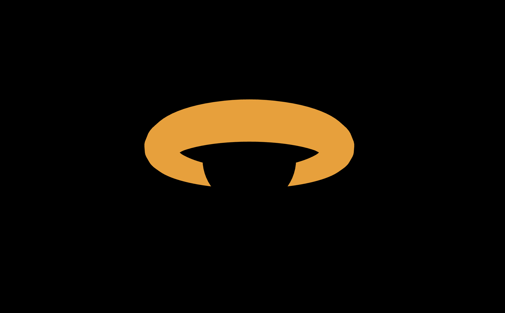

# Geodesica

A [geodesic](https://en.wikipedia.org/wiki/Geodesic) is a fancy name for the shortest path between two points.

The blackhole in Interstellar was tweaked scientifically for the narrative. The actual thing
would look quite different.

Geodesica will be a brower-based game that aims to simulate the blackhole accurately (hopefully), and eventually include star evolution.
The end goal is for the player to be able to travel around a galaxy they generated on their own by tweaking the inital parameters when a galaxy is born.

The physics used for Interstellar was published in two papers:

1. [Visualising the wormhole](https://arxiv.org/pdf/1502.03809)
2. [Gravitational lensing in spinning black holes](https://arxiv.org/pdf/1502.03808)

I have no experience at all in simulating anything (but the [Stardance website](https://stardance.hackclub.com/) says no experience needed at all), and the physics is super intimidating, this will probably be very hard, but it will definitely look really cool if I do it somewhat right.

The goal is to start simple and keep improving.

Currently:



This will be hosted pretty soon!

## Run locally (the frontend)

1. Build the development Docker image, from inside the `geodesica-frontend/` directory

    ```zsh
    docker build -t geodesica:frontend -f ../server/docker/Dockerfile.dev .
    ```

2. Run the image on your machine:

    ```zsh
    docker run geodesica:frontend
    ```
